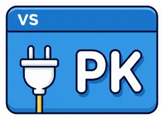

# VS_pkvsconf



✨ Extension VS Code simple, claire et sympa pour booster ton Explorer.

Extension VS Code qui ajoute plusieurs fonctionnalités utiles : bouton pour reveler le fichier actif dans Finder (macOS), indicateur de taille du dossier racine, panneau "Project Icon", preview de pages HTML/PHP avec serveur automatique, gestion de tags d'extensions, et personnalisation de la couleur de la title bar par workspace.

## ✅ Fonctionnalites

- 🧭 Reveal in Finder (macOS)

  Bouton dans la barre de titre de l'Explorer (en haut du panneau fichiers). Ouvre le fichier actif ou le dossier du workspace dans Finder.

- 📦 Taille du dossier racine

  Indicateur en bas (status bar) avec rafraichissement automatique et clic pour forcer la mise a jour.

- 🖼️ Project Icon

  Place un fichier `icon.*` (ex: `icon.png`) a la racine du workspace. L'icone s'affiche dans l'Explorer; sinon un message d'aide est affiche.

- 🐙 Open GitHub Repository

  Bouton dans l'onglet Source Control. Ouvre le repo GitHub du projet; si plusieurs repos sont detectes, un choix est propose.

- 🏷️ Tags d'extensions

  Clic droit sur une extension pour "Add Tag" ou "Create Tag". Une vue "Extension Tags" apparait dans l'Explorer avec des sections par tag (collapse/expand).

- 👁️ Preview de la page en cours

  Bouton dans la barre de statut (status bar) en bas. Ouvre une preview de la page HTML/PHP/etc actuellement ouverte dans un nouvel onglet (remplace l'onglet actif). Pour les fichiers PHP, un serveur PHP local est lancé automatiquement. Le serveur s'arrête automatiquement quand l'onglet de preview est fermé.

- 🎨 Couleur de title bar par workspace

  Une couleur est assignee automatiquement a chaque workspace pour distinguer les fenetres. La couleur est persistante et regenerable via le bouton "Title Bar" dans la status bar ou la commande palette "Regenerer la couleur de la title bar". Chaque clic génère une nouvelle couleur aléatoire.

- 🔐 Detection des secrets exposes

  Scan automatique du workspace pour detecter les secrets (cles API, tokens, mots de passe, etc.). Un indicateur dans la status bar affiche le nombre de secrets detectes. Cliquez dessus pour voir la liste et naviguer vers les fichiers concernes.

- 🛡️ Blocage de commit avec secrets

  Commande "Commit (verification secrets)" qui scanne les fichiers staged avant le commit. Si des secrets sont detectes, un popup modal bloque le commit et propose : voir les secrets, les ajouter au .gitignore, ou forcer le commit. Raccourci : `Cmd+Shift+Enter` (Mac) / `Ctrl+Shift+Enter` (Windows/Linux).

## 📁 Arborescence

- `extension/` : code de l'extension, build, scripts
- `openspec/` : specs OpenSpec
- `release/` : packages .vsix generes

## 🛠️ Build, package et installation (.vsix)

### Build local

Depuis les sources (build + package) :

```bash
cd extension && npm run release
```

Le .vsix est genere dans `release/` automatiquement (ex: `vs-pkvsconf-0.3.30.vsix`).

### Installation depuis .vsix

- Commande palette (macOS: Cmd+Shift+P, Windows/Linux: Ctrl+Shift+P): "Extensions: Install from VSIX..."
- Selectionner le fichier `vs-pkvsconf-0.3.30.vsix` dans `release/`
- Recharger la fenetre

### Publication vers VS Code Marketplace

Voir le fichier [PUBLISH.md](PUBLISH.md) pour les instructions détaillées.

**Méthode simple (recommandée)** :
```bash
cd extension
npm install -g @vscode/vsce
vsce login
npm run build
vsce publish
```

**Publication automatique via GitHub Actions** :
- Configurer un Personal Access Token (voir PUBLISH.md)
- Créer une release GitHub ou utiliser "Run workflow"

## 🧾 Release Notes

### 0.3.35

- 🚨 Warning automatique des qu'un fichier avec secret est stage. Plus besoin d'utiliser une commande speciale, le warning s'affiche automatiquement.

### 0.3.34

- 🛡️ Nouvelle fonctionnalite : Blocage de commit avec secrets. Scanne les fichiers staged avant commit et bloque si des secrets sont detectes. Options : voir les secrets, ajouter au .gitignore, ou forcer le commit.
- 🔐 Ajout de la detection des secrets exposes dans le workspace avec indicateur dans la status bar.

### 0.3.30

- 🎨 Ajout d'un bouton dans la status bar pour changer la couleur de la title bar (en plus de la commande palette).

### 0.3.29

- 👁️ Ajout de la fonctionnalité Preview de la page en cours. Bouton dans la status bar pour ouvrir une preview dans un nouvel onglet. Support PHP avec serveur automatique.

### 0.3.23

- 🏷️ Nouvel icone d'onglet \"PK Extensions\".

### 0.3.22

- 🏷️ Nom de l'extension conserve en \"VS_pkvsconf\" et onglet affiche \"PK Extensions\".

### 0.3.21

- 🏷️ Renommage de l'onglet en \"PK Extensions\".

### 0.3.20

- 🧩 Nouveau pictogramme d'onglet (style extension/puzzle) et nom \"PK Extension\".

### 0.3.19

- 🏷️ Mise a jour de l'icone de l'onglet Extensions (tag plus explicite).

### 0.3.6

- 🏷️ La vue "Extension Tags" est maintenant dans l'Explorer (plus stable que l'onglet Extensions).

### 0.3.5

- 🏷️ Ajustement du container de vue "Extension Tags" pour l'onglet Extensions.

### 0.3.4

- 🏷️ Fix de l'enregistrement de la vue "Extension Tags" dans l'onglet Extensions.

### 0.3.3

- 🏷️ Ajout du tagging d'extensions avec vue "Extension Tags" (sections par tag, collapse/expand).
- 🐙 Open GitHub Repository supporte le multi-repo (selection si plusieurs repos).
