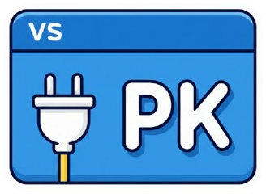

# VS_pkvsconf



[🇫🇷 FR](README.md) · [🇬🇧 EN](README_en.md)

✨ Extension VS Code simple pour booster l'Explorer et la navigation du projet.

## ✅ Fonctionnalites

- 🧭 Reveal in Finder (macOS)
- 📦 Taille du dossier racine
- 🖼️ Project Icon
- 🐙 Open GitHub Repository
- 🏷️ Tags d'extensions
- 👁️ Preview de la page en cours
- 🎨 Couleur de title bar par workspace
- 🔐 Detection des secrets exposes
- 🛡️ Blocage de commit avec secrets
- 🚀 Launchpad projets (vue plein écran type macOS Launchpad + bascule rapide)
- 📋 Kanban TUI avec cartes Backlog, In Progress, In Review et Done
- 🔗 Agent Skills : symlink `.agent` vers le dossier central `-agent`
## 🧠 Utilisation

- Reveal in Finder : bouton en haut du panneau Explorer (macOS).
- Taille du dossier racine : indicateur en status bar, clic pour rafraichir.
- Project Icon : place un `icon.*` a la racine pour afficher l'icone.
- Open GitHub Repository : bouton dans Source Control.
- Tags d'extensions : clic droit sur une extension pour taguer.
- Preview page : bouton en status bar, support PHP avec serveur auto.
- Title bar : couleur auto par workspace, bouton pour regenerer.
- Secrets : scan workspace + blocage de commit si secrets staged.
- Agent Skills : cree un lien symbolique `.agent` vers le dossier central `-agent`.
- Launchpad : bouton `Projets` pour l'ancienne liste rapide, bouton `Launchpad` pour une grille plein écran avec recherche, navigation aux flèches, réglages lignes/colonnes/taille, ajout, suppression et ouverture en nouvelle fenêtre. Raccourci `Cmd/Ctrl+Alt+L`.
- Kanban : bouton `Kanban` dans la barre de status. Chaque carte active lance ou reprend une session OpenCode dans `tmux`; le passage en Done conserve l'historique et ferme la session.

## ⚙️ Reglages

Le Kanban utilise :

- `pkvsconf.kanban.agentCommand` : commande d'agent, par défaut `opencode --prompt {prompt}`.
- `pkvsconf.kanban.tmuxCommand` : exécutable tmux, par défaut `tmux`.

Les couleurs de la status bar utilisent :

- `pkvsconf.rootSizeStatusBarItem.background`
- `pkvsconf.rootSizeStatusBarItem.foreground`

## 🧾 Commandes

- Reveal Active File in Finder
- Refresh Root Folder Size
- Open GitHub Repository
- Catégorie (Add Tag)
- Rechercher des extensions
- Regenerer la couleur de la title bar
- Preview de la page en cours
- Afficher les secrets exposes
- Rescanner les secrets
- Commit (verification secrets)
- Agent Skills
- Ouvrir le Kanban des agents

## 📦 Build & Package

```bash
cd src
npm run release
```

## 🧪 Installation (Antigravity)

- Palette de commandes : "Extensions: Install from VSIX..."
- Selectionner `release/vs-pkvsconf-2.13.0.vsix`
- Recharger la fenetre

## 🧾 Release Notes

### 2.13.0

- 📋 Nouveau Kanban TUI persistant par workspace, accessible depuis la barre de status.
- 🤖 Une session `tmux` OpenCode par carte active, avec reprise, feedback et arrêt manuel.
- ✅ Cycle Backlog, In Progress, In Review et Done avec historique, diff, commit et push explicites.

### 2.9.1

- 📂 Le clic sur `Root size` dans la status bar ouvre maintenant le dossier racine du workspace dans Finder.

### 2.9.0

- 🎛️ Ajout d'un choix de thème Launchpad `Sleek` / `Classique`, sauvegardé dans les réglages.
- ⚙️ L'écran de préférences du Launchpad centralise thème, grille, couleur de focus, accès aux réglages VS Code et configuration des raccourcis.

### 2.8.1

- 🎨 Nouveau thème Launchpad inspiré de `launchpad1.html` : fond sombre animé, cartes glass, recherche en pilule et dock flottant.
- 🎛️ Réglages colonnes/lignes/pictos déplacés dans une modale accessible depuis le dock.

### 2.8.0

- 🎯 Focus clavier Launchpad plus visible en bleu électrique, configurable via `pkvsconf.launchpad.focusColor`.
- 🔤 Logos fallback ASCII 5x5 avec couleur/gradient stable différent par projet.

### 2.7.1

- 🎨 Launchpad plus léger : suppression des cadres autour des pictos et focus discret sur le label.
- 🔤 Nouveau logo fallback typographique/ASCII pour les projets sans `icon.png`.

### 2.7.0

- 🔎 Dans le Launchpad, taper directement filtre les projets sans devoir cliquer la recherche.
- 🖱️ Clic droit sur un projet : ouvrir, afficher dans Finder ou retirer du Launchpad.
- 🎛️ Dock simplifié avec actions lisibles uniquement en bas.
- ⌨️ Raccourcis clavier déclarés pour les commandes Launchpad, configurables dans les préférences VS Code.

### 2.6.1

- 🚀 Cliquer le projet courant dans le Launchpad ferme la vue au lieu d'ouvrir une nouvelle fenêtre.

### 2.6.0

- 🚀 Séparation de l'ancienne liste projets et du Launchpad plein écran en deux boutons de status bar.
- ⌨️ Navigation au clavier dans le Launchpad avec les flèches et Entrée.
- 🎛️ Réglages intégrés pour colonnes, lignes visibles et taille des pictogrammes, avec scroll vertical sans pagination.
- 🖥️ Ouverture du Launchpad dans le groupe principal avec masquage des panneaux pour maximiser l'espace.

### 2.5.0

- 🚀 Nouveau Launchpad plein écran depuis la barre de status, inspiré du Launchpad macOS.
- 🔎 Recherche intégrée, ajout du workspace courant/dossier, suppression et rafraîchissement depuis la vue.

### 2.2.0

- 🎛️ Launchpad en grille limitée à ~4 apps par ligne (responsive).

### 2.1.0

- 🚀 Launchpad projets : vue explorateur + statut bar + raccourci pour ouvrir/basculer entre projets.
- 🗂️ Deux sections : projets en cours et projets du launchpad (config `pkvsconf.launchpad.projects`).
- 🔍 Commande pour ajouter le workspace courant au launchpad.
- 🛠️ Correctif : enregistrement du paramètre `pkvsconf.launchpad.projects`.

### 2.0.0

- 🚀 Launchpad projets : vue explorateur + statut bar + raccourci pour ouvrir/basculer entre projets.
- 🗂️ Deux sections : projets en cours et projets du launchpad (config `pkvsconf.launchpad.projects`).
- 🔍 Commande pour ajouter le workspace courant au launchpad.

### 1.40.0

- 🔗 Le bouton `Agent Skills` cree maintenant un symlink `.agent` vers `-agent`.
- 🔁 Si `.agent` existe deja mais pointe ailleurs, le lien est remplace automatiquement.
- ✅ Si `.agent` pointe deja vers `-agent`, un message indique qu'il est deja present.

### 1.39

- 📝 Alignement du `src/README.md` sur le meme contenu que le README GitHub.

### 1.38

- 📝 Ajout d'un `src/README.md` pour alimenter correctement l'overview du Visual Studio Marketplace.
- 🔗 Ajout du lien vers la page publisher du store dans le README.

### 1.37

- 🔗 Le bouton devient `Agent Skills` et cree maintenant le symlink `.agent` vers le dossier central `-agent`.
- 🛡️ `.agent/` et les patterns de secrets locaux sont ignores par Git pour eviter les commits accidentels.
- 🔗 Ajout d'un lien direct vers la page Marketplace dans le README.

### 0.3.37

- 🔗 Ajout de la commande pour creer un symlink `.skills` vers un dossier central.

### 0.3.36

- 📝 Passage de la licence en MIT.

### 0.3.35

- 🚨 Warning automatique des qu'un fichier avec secret est stage. Plus besoin d'utiliser une commande speciale, le warning s'affiche automatiquement.

### 0.3.34

- 🛡️ Nouvelle fonctionnalite : Blocage de commit avec secrets. Scanne les fichiers staged avant commit et bloque si des secrets sont detectes. Options : voir les secrets, ajouter au .gitignore, ou forcer le commit.
- 🔐 Ajout de la detection des secrets exposes dans le workspace avec indicateur dans la status bar.

### 0.3.30

- 🎨 Ajout d'un bouton dans la status bar pour changer la couleur de la title bar (en plus de la commande palette).

### 0.3.29

- 👁️ Ajout de la fonctionnalité Preview de la page en cours. Bouton dans la status bar pour ouvrir une preview dans un nouvel onglet. Support PHP avec serveur automatique.

### 0.3.23

- 🏷️ Nouvel icone d'onglet \"PK Extensions\".

### 0.3.22

- 🏷️ Nom de l'extension conserve en \"VS_pkvsconf\" et onglet affiche \"PK Extensions\".

### 0.3.21

- 🏷️ Renommage de l'onglet en \"PK Extensions\".

### 0.3.20

- 🧩 Nouveau pictogramme d'onglet (style extension/puzzle) et nom \"PK Extension\".

### 0.3.19

- 🏷️ Mise a jour de l'icone de l'onglet Extensions (tag plus explicite).

### 0.3.6

- 🏷️ La vue "Extension Tags" est maintenant dans l'Explorer (plus stable que l'onglet Extensions).

### 0.3.5

- 🏷️ Ajustement du container de vue "Extension Tags" pour l'onglet Extensions.

### 0.3.4

- 🏷️ Fix de l'enregistrement de la vue "Extension Tags" dans l'onglet Extensions.

### 0.3.3

- 🏷️ Ajout du tagging d'extensions avec vue "Extension Tags" (sections par tag, collapse/expand).
- 🐙 Open GitHub Repository supporte le multi-repo (selection si plusieurs repos).

## 🔗 Liens

- EN README : README_en.md
- VS Code Marketplace : https://marketplace.visualstudio.com/items?itemName=Cmondary.vs-pkvsconf
- Publisher Marketplace : https://marketplace.visualstudio.com/publishers/Cmondary
